# UML Class Diagram - Airplane Fleet Management System

## REQUIREMENT FULFILLED: UML Class Diagram (10 points)

```
+----------------------------------------------------------+
|                       PlaneClass                          |
+----------------------------------------------------------+
| - manufacturer_: string                                   |
| - model_: string                                          |
| - seatCount_: int                                         |
| - minRunwayLength_: double                                |
| - fuelConsumptionPerKmPerSeat_: double                    |
| - tankVolumeLiters_: double                               |
| - averageSpeedKmh_: double                                |
| - requiredCrewCount_: int                                 |
+----------------------------------------------------------+
| + PlaneClass()                                            |
| + PlaneClass(manufacturer: string, model: string,         |
|              seatCount: int, minRunwayLength: double,     |
|              fuelConsumption: double, tankVolume: double, |
|              avgSpeed: double, crewCount: int)            |
| + PlaneClass(other: const PlaneClass&)                    |
| + ~PlaneClass()                                           |
+----------------------------------------------------------+
| + getManufacturer(): string                               |
| + getModel(): string                                      |
| + getSeatCount(): int                                     |
| + getMinRunwayLength(): double                            |
| + getFuelConsumptionPerKmPerSeat(): double                |
| + getTankVolumeLiters(): double                           |
| + getAverageSpeedKmh(): double                            |
| + getRequiredCrewCount(): int                             |
| + setManufacturer(manufacturer: string): void             |
| + setModel(model: string): void                           |
| + setSeatCount(count: int): void                          |
| + setMinRunwayLength(length: double): void                |
| + setFuelConsumptionPerKmPerSeat(consumption: double)     |
| + setTankVolumeLiters(volume: double): void               |
| + setAverageSpeedKmh(speed: double): void                 |
| + setRequiredCrewCount(count: int): void                  |
| + getClassId(): string                                    |
| + calculateMaxRange(): double                             |
| + calculateFlightDuration(distanceKm: double): double     |
| + calculateFuelConsumption(distanceKm: double,            |
|                            passengers: int): double       |
| + isCompatibleWithRunway(runwayLength: double): bool      |
| + operator==(other: const PlaneClass&): bool              |
| <<friend>> operator<<(os: ostream&, planeClass)           |
| <<friend>> operator>>(is: istream&, planeClass)           |
+----------------------------------------------------------+

+----------------------------------------------------------+
|                       Destination                         |
+----------------------------------------------------------+
| - code_: string                                           |
| - name_: string                                           |
| - city_: string                                           |
| - country_: string                                        |
| - runwayLengthMeters_: double                             |
| - distanceFromBaseKm_: double                             |
+----------------------------------------------------------+
| + Destination()                                           |
| + Destination(code: string, name: string, city: string,   |
|               country: string, runwayLength: double,      |
|               distance: double)                           |
| + Destination(other: const Destination&)                  |
| + ~Destination()                                          |
+----------------------------------------------------------+
| + getCode(): string                                       |
| + getName(): string                                       |
| + getCity(): string                                       |
| + getCountry(): string                                    |
| + getRunwayLengthMeters(): double                         |
| + getDistanceFromBaseKm(): double                         |
| + setCode(code: string): void                             |
| + setName(name: string): void                             |
| + setCity(city: string): void                             |
| + setCountry(country: string): void                       |
| + setRunwayLengthMeters(length: double): void             |
| + setDistanceFromBaseKm(distance: double): void           |
| + getDisplayString(): string                              |
| + operator==(other: const Destination&): bool             |
| <<friend>> operator<<(os: ostream&, destination)          |
| <<friend>> operator>>(is: istream&, destination)          |
+----------------------------------------------------------+

+----------------------------------------------------------+
|                        Airplane                           |
+----------------------------------------------------------+
| - identificationNumber_: string                           |
| - planeClass_: PlaneClass                                 |
| - isOperational_: bool                                    |
| - baseAirportCode_: string                                |
| - totalFlightHours_: int                                  |
+----------------------------------------------------------+
| + Airplane()                                              |
| + Airplane(id: string, planeClass: const PlaneClass&)     |
| + Airplane(id: string, planeClass: const PlaneClass&,     |
|            operational: bool, baseAirport: string,        |
|            flightHours: int)                              |
| + Airplane(other: const Airplane&)                        |
| + ~Airplane()                                             |
+----------------------------------------------------------+
| + getIdentificationNumber(): string                       |
| + getPlaneClass(): PlaneClass                             |
| + isOperational(): bool                                   |
| + getBaseAirportCode(): string                            |
| + getTotalFlightHours(): int                              |
| + getPlaneClassRef(): const PlaneClass&                   |
| + setIdentificationNumber(id: string): void               |
| + setPlaneClass(planeClass: const PlaneClass&): void      |
| + setOperational(operational: bool): void                 |
| + setBaseAirportCode(code: string): void                  |
| + setTotalFlightHours(hours: int): void                   |
| + canFlyToDestination(runwayLength: double,               |
|                       distance: double): bool             |
| + calculateOperatingCost(distanceKm: double,              |
|                          passengers: int): double         |
| + addFlightHours(hours: int): void                        |
| + operator=(other: const Airplane&): Airplane&            |
| + operator==(other: const Airplane&): bool                |
| <<friend>> operator<<(os: ostream&, airplane)             |
| <<friend>> operator>>(is: istream&, airplane)             |
+----------------------------------------------------------+

+----------------------------------------------------------+
|                      FleetManager                         |
+----------------------------------------------------------+
| - airplanes_: vector<Airplane>                            |
| - destinations_: vector<Destination>                      |
| - planeClasses_: vector<PlaneClass>                       |
| - companyName_: string                                    |
| - dataDirectory_: string                                  |
+----------------------------------------------------------+
| - saveAirplanesToFile(filename: string): bool             |
| - loadAirplanesFromFile(filename: string): bool           |
| - saveDestinationsToFile(filename: string): bool          |
| - loadDestinationsFromFile(filename: string): bool        |
| - savePlaneClassesToFile(filename: string): bool          |
| - loadPlaneClassesFromFile(filename: string): bool        |
+----------------------------------------------------------+
| + FleetManager()                                          |
| + FleetManager(companyName: string,                       |
|                dataDirectory: string)                     |
| + FleetManager(other: const FleetManager&)                |
| + ~FleetManager()                                         |
+----------------------------------------------------------+
| + getCompanyName(): string                                |
| + getDataDirectory(): string                              |
| + getAirplaneCount(): size_t                              |
| + getDestinationCount(): size_t                           |
| + getPlaneClassCount(): size_t                            |
| + getAirplanes(): const vector<Airplane>&                 |
| + getDestinations(): const vector<Destination>&           |
| + getPlaneClasses(): const vector<PlaneClass>&            |
| + setCompanyName(name: string): void                      |
| + setDataDirectory(directory: string): void               |
| + addPlaneClass(planeClass: const PlaneClass&): bool      |
| + addAirplane(airplane: const Airplane&): bool            |
| + addDestination(destination: const Destination&): bool   |
| + removeAirplane(id: string): bool                        |
| + removeDestination(code: string): bool                   |
| + findAirplaneById(id: string): Airplane*                 |
| + findDestinationByCode(code: string): Destination*       |
| + findPlaneClassById(classId: string): PlaneClass*        |
| + findAirplanesForDestination(destinationCode: string)    |
|                                 : vector<Airplane*>       |
| + findCompatibleAirplanes(runwayLength: double,           |
|                           distance: double)               |
|                           : vector<Airplane*>             |
| + getOperationalAirplanes(): vector<Airplane*>            |
| + displayAllAirplanes(os: ostream&): void                 |
| + displayAllDestinations(os: ostream&): void              |
| + displayAllPlaneClasses(os: ostream&): void              |
| + saveAllData(): bool                                     |
| + loadAllData(): bool                                     |
| + clearAllData(): void                                    |
| <<friend>> operator<<(os: ostream&, manager)              |
+----------------------------------------------------------+


                    CLASS RELATIONSHIPS
                    ===================

    +-------------+          +-------------+
    | PlaneClass  |          | Destination |
    +-------------+          +-------------+
          ^                        ^
          |                        |
          | 1                      | *
          |                        |
    +-----+-----+          +-------+-------+
    |           |          |               |
    |  Airplane +----------+ FleetManager  |
    |           |    *     |               |
    +-----------+          +---------------+
         |                       |
         +-----------------------+
                    *

    Legend:
    -------
    ─────────────  Association
    ◆─────────────  Composition (Airplane contains PlaneClass)
    *              Many
    1              One


                  RELATIONSHIP DESCRIPTIONS
                  =========================

    1. Airplane <> PlaneClass (Composition)
       - Each Airplane contains exactly one PlaneClass
       - PlaneClass determines the airplane's capabilities
       - The PlaneClass is copied into the Airplane (not a pointer)

    2. FleetManager <> Airplane (Aggregation)
       - FleetManager manages multiple Airplanes
       - Airplanes are stored in a vector
       - FleetManager can add/remove airplanes

    3. FleetManager <> Destination (Aggregation)
       - FleetManager manages multiple Destinations
       - Destinations are stored in a vector
       - FleetManager can add/remove destinations

    4. FleetManager <> PlaneClass (Aggregation)
       - FleetManager maintains a registry of PlaneClasses
       - Used for linking airplanes to their classes
       - Enables validation of plane class existence


                  REQUIREMENTS FULFILLED
                  ======================

    1. At least 3 classes: PlaneClass, Destination, Airplane, FleetManager (4 classes)
    2. Private instance variables: All classes use private members with _ suffix
    3. At least 2 constructors per class: Default + Parameterized + Copy
    4. Public getters/setters: All private members have public accessors
    5. Input validation: Implemented in setters and constructors
    6. Overloaded << operator: All classes implement operator<<
    7. File I/O: FleetManager handles reading/writing to files
    8. Arbitrary number of airplanes: Vector-based storage
    9. Search functionality: findAirplanesForDestination()
```

## PlantUML Version

```plantuml
@startuml AirplaneFleetManagement

skinparam classAttributeIconSize 0
skinparam class {
    BackgroundColor White
    BorderColor Black
    ArrowColor Black
}

class PlaneClass {
    -manufacturer_: string
    -model_: string
    -seatCount_: int
    -minRunwayLength_: double
    -fuelConsumptionPerKmPerSeat_: double
    -tankVolumeLiters_: double
    -averageSpeedKmh_: double
    -requiredCrewCount_: int
    __
    +PlaneClass()
    +PlaneClass(manufacturer, model, ...)
    +PlaneClass(other: PlaneClass)
    +~PlaneClass()
    __
    +getManufacturer(): string
    +getModel(): string
    +getSeatCount(): int
    +getMinRunwayLength(): double
    +getFuelConsumptionPerKmPerSeat(): double
    +getTankVolumeLiters(): double
    +getAverageSpeedKmh(): double
    +getRequiredCrewCount(): int
    +setManufacturer(manufacturer): void
    +setModel(model): void
    +setSeatCount(count): void
    +setMinRunwayLength(length): void
    +setFuelConsumptionPerKmPerSeat(consumption): void
    +setTankVolumeLiters(volume): void
    +setAverageSpeedKmh(speed): void
    +setRequiredCrewCount(count): void
    +getClassId(): string
    +calculateMaxRange(): double
    +calculateFlightDuration(distance): double
    +calculateFuelConsumption(distance, passengers): double
    +isCompatibleWithRunway(runwayLength): bool
    +operator==(other): bool
    +{static} operator<<(os, planeClass): ostream&
    +{static} operator>>(is, planeClass): istream&
}

class Destination {
    -code_: string
    -name_: string
    -city_: string
    -country_: string
    -runwayLengthMeters_: double
    -distanceFromBaseKm_: double
    __
    +Destination()
    +Destination(code, name, city, country, ...)
    +Destination(other: Destination)
    +~Destination()
    __
    +getCode(): string
    +getName(): string
    +getCity(): string
    +getCountry(): string
    +getRunwayLengthMeters(): double
    +getDistanceFromBaseKm(): double
    +setCode(code): void
    +setName(name): void
    +setCity(city): void
    +setCountry(country): void
    +setRunwayLengthMeters(length): void
    +setDistanceFromBaseKm(distance): void
    +getDisplayString(): string
    +operator==(other): bool
    +{static} operator<<(os, destination): ostream&
    +{static} operator>>(is, destination): istream&
}

class Airplane {
    -identificationNumber_: string
    -planeClass_: PlaneClass
    -isOperational_: bool
    -baseAirportCode_: string
    -totalFlightHours_: int
    __
    +Airplane()
    +Airplane(id, planeClass)
    +Airplane(id, planeClass, operational, ...)
    +Airplane(other: Airplane)
    +~Airplane()
    __
    +getIdentificationNumber(): string
    +getPlaneClass(): PlaneClass
    +isOperational(): bool
    +getBaseAirportCode(): string
    +getTotalFlightHours(): int
    +getPlaneClassRef(): PlaneClass&
    +setIdentificationNumber(id): void
    +setPlaneClass(planeClass): void
    +setOperational(operational): void
    +setBaseAirportCode(code): void
    +setTotalFlightHours(hours): void
    +canFlyToDestination(runwayLength, distance): bool
    +calculateOperatingCost(distance, passengers): double
    +addFlightHours(hours): void
    +operator=(other): Airplane&
    +operator==(other): bool
    +{static} operator<<(os, airplane): ostream&
    +{static} operator>>(is, airplane): istream&
}

class FleetManager {
    -airplanes_: vector<Airplane>
    -destinations_: vector<Destination>
    -planeClasses_: vector<PlaneClass>
    -companyName_: string
    -dataDirectory_: string
    __
    -saveAirplanesToFile(filename): bool
    -loadAirplanesFromFile(filename): bool
    -saveDestinationsToFile(filename): bool
    -loadDestinationsFromFile(filename): bool
    -savePlaneClassesToFile(filename): bool
    -loadPlaneClassesFromFile(filename): bool
    __
    +FleetManager()
    +FleetManager(companyName, dataDirectory)
    +FleetManager(other: FleetManager)
    +~FleetManager()
    __
    +getCompanyName(): string
    +getDataDirectory(): string
    +getAirplaneCount(): size_t
    +getDestinationCount(): size_t
    +getPlaneClassCount(): size_t
    +getAirplanes(): vector<Airplane>&
    +getDestinations(): vector<Destination>&
    +getPlaneClasses(): vector<PlaneClass>&
    +setCompanyName(name): void
    +setDataDirectory(directory): void
    +addPlaneClass(planeClass): bool
    +addAirplane(airplane): bool
    +addDestination(destination): bool
    +removeAirplane(id): bool
    +removeDestination(code): bool
    +findAirplaneById(id): Airplane*
    +findDestinationByCode(code): Destination*
    +findPlaneClassById(classId): PlaneClass*
    +findAirplanesForDestination(code): vector<Airplane*>
    +findCompatibleAirplanes(runway, distance): vector<Airplane*>
    +getOperationalAirplanes(): vector<Airplane*>
    +displayAllAirplanes(os): void
    +displayAllDestinations(os): void
    +displayAllPlaneClasses(os): void
    +saveAllData(): bool
    +loadAllData(): bool
    +clearAllData(): void
    +{static} operator<<(os, manager): ostream&
}

Airplane *-- PlaneClass : contains
FleetManager "1" o-- "*" Airplane : manages
FleetManager "1" o-- "*" Destination : manages
FleetManager "1" o-- "*" PlaneClass : registers

@enduml
```


